# Plant Categories and Subcategories ERD

This diagram illustrates the structure of plant categories, families, and individual plants within the project.

## Mermaid Flowchart

```mermaid
graph TD
    %% Root Node
    Garden[My Plant DB]

    %% Main Categories
    Garden --> Vegetables[Vegetables & Fruit]
    Garden --> Herbs[Herbs]
    Garden --> Flowers[Flowers]

    %% Vegetables Grouping
    subgraph Vegetables_Sub [Vegetable & Fruit Families]
        Vegetables --> Solanaceae[Solanaceae]
        Vegetables --> Brassicaceae[Brassicaceae]
        Vegetables --> Cucurbitaceae[Cucurbitaceae]
        Vegetables --> Asteraceae_Veg[Asteraceae]
    end

    %% Herbs Grouping
    subgraph Herbs_Sub [Herb Families]
        Herbs --> Lamiaceae_Herb[Lamiaceae]
        Herbs --> Apiaceae[Apiaceae]
        Herbs --> Amaryllidaceae[Amaryllidaceae]
        Herbs --> Brassicaceae_Herb[Brassicaceae]
    end

    %% Flowers Grouping
    subgraph Flowers_Sub [Flower Families]
        Flowers --> Asteraceae_Flow[Asteraceae]
        Flowers --> Plantaginaceae[Plantaginaceae]
        Flowers --> Tropaeolaceae[Tropaeolaceae]
        Flowers --> Brassicaceae_Flow[Brassicaceae]
        Flowers --> Caryophyllaceae[Caryophyllaceae]
    end

    %% Plants - Solanaceae
    Solanaceae --> TT_Red[Tumbling Tom Red]
    Solanaceae --> TT_Yellow[Tumbling Tom Yellow]

    %% Plants - Brassicaceae
    Brassicaceae --> Radish[Radish]
    Brassicaceae_Herb --> Rocket[Rocket]

    %% Plants - Cucurbitaceae
    Cucurbitaceae --> Courgette[Courgette]

    %% Plants - Asteraceae
    Asteraceae_Veg --> Lettuce[Lettuce]
    Asteraceae_Flow --> Marigold[Marigold]

    %% Plants - Lamiaceae
    Lamiaceae_Herb --> Basil[Basil]
    Lamiaceae_Herb --> Mint[Mint]
    Lamiaceae_Herb --> Lavender[Lavender]

    %% Plants - Apiaceae
    Apiaceae --> Coriander[Coriander]

    %% Plants - Amaryllidaceae
    Amaryllidaceae --> Chives[Chives]

    %% Plants - Others
    Plantaginaceae --> Snapdragon[Snapdragon]
    Tropaeolaceae --> Nasturtium[Nasturtium]
    Caryophyllaceae --> Carnation[Carnation Pinks]

    %% Styling
    classDef category fill:#2d6a4f,stroke:#fff,color:#fff,font-weight:bold;
    classDef family fill:#52b788,stroke:#2d6a4f,color:#000;
    classDef plant fill:#d8f3dc,stroke:#2d6a4f,color:#000;

    class Vegetables,Herbs,Flowers category;
    class Solanaceae,Brassicaceae,Cucurbitaceae,Asteraceae_Veg,Lamiaceae_Herb,Apiaceae,Amaryllidaceae,Brassicaceae_Herb,Asteraceae_Flow,Plantaginaceae,Tropaeolaceae,Caryophyllaceae family;
    class TT_Red,TT_Yellow,Radish,Rocket,Courgette,Lettuce,Marigold,Basil,Mint,Lavender,Coriander,Chives,Snapdragon,Nasturtium,Carnation plant;
```

## Data Structure (JSON)

Each plant is defined in its own JSON file with the following relevant fields:

| Field | Description | Example |
| :--- | :--- | :--- |
| `category` | High-level grouping (herb, vegetable, flower, or fruit) used for filtering in the UI. | `herb`, `vegetable`, `flower`, `fruit` |
| `family` | Botanical family (used here as a subcategory). | `Lamiaceae`, `Solanaceae` |
| `id` | Unique slug/identifier for the plant. | `basil` |
| `commonName`| User-friendly name. | `Sweet Basil` |
| `edible` | Object describing if the plant/flower is edible (mostly for the flower category). | `{ "isEdible": true, "notes": "..." }` |
